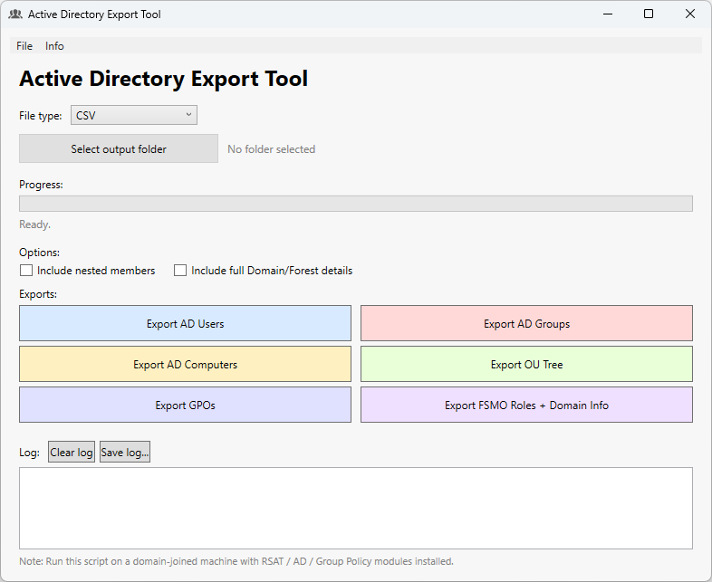

# AD_Export-Tool

[](https://github.com/karanikn/AD_Export-Tool)
[](https://github.com/PowerShell/PowerShell)
[](https://www.microsoft.com/windows)
[](https://github.com/karanikn/AD_Export-Tool/blob/main/LICENSE)
[](https://claude.ai)

> **A WPF GUI tool for exporting Active Directory Users, Groups, Computers, OUs, GPOs, and FSMO Roles to CSV or TXT.**  
> Single-file PowerShell script — no installation required.

---

## 📸 Screenshots

| Main Window |
| --- |
|  |

---

## ✨ Overview

**AD_Export-Tool** is a single-file PowerShell WPF application that provides a clean, modern GUI for exporting Active Directory data. Designed for IT administrators who need quick, reliable AD reports without writing one-off scripts or navigating RSAT consoles.

All exports support both **CSV** and **TXT** output formats. A built-in logging panel tracks every action in real time.

---

## 🚀 Quick Start

```powershell
Set-ExecutionPolicy RemoteSigned -Scope Process
.\AD_Export-Tool.ps1
```

### Requirements

| Requirement | Details |
| --- | --- |
| OS | Windows 10 / 11 / Server 2016+ |
| PowerShell | 5.1 or later (PS7 also supported) |
| Modules | RSAT — `ActiveDirectory` module (for Users, Groups, Computers, OUs, FSMO) |
|  | `GroupPolicy` module (for GPO export only) |
| Domain | Machine must be domain-joined |

---

## 🖥️ Interface

The application features a flat, modern single-window layout:

- **Menu bar** — File (folder selection, save log, exit) · Info (module status, about)
- **File type selector** — CSV or TXT
- **Output folder picker** — modern dialog (WindowsAPICodePack) with classic fallback
- **Progress bar** — real-time progress with status text
- **Export buttons** — one button per export type, color-coded
- **Log panel** — timestamped real-time log with Clear and Save buttons

---

## 📋 Export Functions

### Export AD Users

Exports all domain user accounts to a single file.

| Field | Description |
| --- | --- |
| SamAccountName | Logon name |
| Name | Full name |
| DisplayName | Display name |
| Mail | Email address |
| Enabled | Account status |
| WhenCreated | Creation date |
| Department | Department |
| Title | Job title |

### Export AD Groups

Exports all domain groups with properties. Optional **nested member** expansion via checkbox.

#### What are Nested Members?

Nested members are users (or computers) that belong to a group **indirectly** — through another group that is itself a member. Active Directory supports nesting groups inside groups, which means a single group can contain members that are several levels deep.

**Example:**

```
Group A
 ├─ User1          ← direct member
 ├─ Group B        ← nested group
 │    ├─ User2     ← nested member
 │    └─ User3     ← nested member
```

With **Include nested members** checked (`-Recursive`):
- Export resolves all levels: **User1, User2, User3**

Without it (unchecked):
- Export shows only direct members: **User1, Group B**

This is important in large AD environments where security groups are built by nesting other groups — without recursive resolution, the actual users who have access through those groups would not appear in the export.

**Groups only** (checkbox unchecked):

| Field | Description |
| --- | --- |
| Name | Group name |
| SamAccountName | Group logon name |
| GroupCategory | Security / Distribution |
| GroupScope | Global / Universal / DomainLocal |
| Description | Group description |
| Mail | Group email |
| ManagedBy | Manager DN |
| WhenCreated | Creation date |
| WhenChanged | Last modified |

**Groups + Nested Members** (checkbox checked) — single file with all groups and their recursively resolved members:

| Field | Description |
| --- | --- |
| GroupName | Parent group |
| MemberSamAccountName | Member logon name |
| MemberName | Member display name |
| ObjectClass | user / computer / group |

### Export AD Computers

| Field | Description |
| --- | --- |
| Name | Computer name |
| SamAccountName | Computer account |
| DNSHostName | FQDN |
| OperatingSystem | OS name |
| OperatingSystemVersion | OS build |
| Enabled | Account status |
| LastLogonDate | Last logon timestamp |
| WhenCreated | Creation date |

### Export OU Tree

Generates an indented tree view of all Organizational Units, sorted by `CanonicalName` for correct parent→child ordering. Output is always `.txt`.

```
Root OU
  Sub OU A
    Sub Sub OU
  Sub OU B
```

### Export GPOs

| Field | Description |
| --- | --- |
| DisplayName | GPO name |
| Id | GPO GUID |
| Owner | Owner |
| CreationTime | Created |
| ModificationTime | Last modified |
| GpoStatus | Enabled / Disabled |
| UserVersion | User config version |
| ComputerVersion | Computer config version |
| WmiFilter | WMI filter name |

### Export FSMO Roles + Domain Info

Exports a `.txt` report containing FSMO role holders and Domain Controllers.

**Default output (checkbox unchecked):**
- Domain name and Forest name (summary line)
- FSMO role holders table (PDCEmulator, RIDMaster, InfrastructureMaster, SchemaMaster, DomainNamingMaster)
- Domain Controllers table (Name, IPv4Address, OperatingSystem)

**With "Include full Domain/Forest details" checked:**
- Full `Get-ADDomain` output (all properties)
- Full `Get-ADForest` output (all properties)
- FSMO role holders table
- Domain Controllers table

---

## 🗂️ File Structure

```
AD_Export-Tool/
├── AD_Export-Tool.ps1       ← PowerShell source
├── Screenshots/
│   └── AD_Export-Tool.png   ← Main window screenshot
├── LICENSE
└── README.md
```

---

## 📝 Changelog

### v1.1 — June 2025

- **About window fix** — resolved `XmlNodeReader` consumed-reader crash on second open; XAML is now re-parsed on every click
- **Hyperlink fix** — About window link uses `RequestNavigate` event (correct WPF pattern) instead of `Click`
- **Version tracking** — added `$script:AppVersion` variable; displayed in About window title
- **Progress bar reset** — each export now resets to 0% before starting, preventing stale 100% display from previous operation
- **UI responsiveness** — added `DoEvents()` pump to `Set-ProgressState` to keep the window responsive during long exports
- **Robust nested member enumeration** — per-group `try/catch` with `-ErrorAction Stop` to handle orphaned SIDs, unresolved objects, and timeouts gracefully (logs warning per group instead of aborting entire export)
- **OU tree sort fix** — changed from alphabetical `DistinguishedName` sort to `CanonicalName` sort for correct parent→child ordering
- **Test-Path operator fix** — fixed operator precedence bug in DLL detection (`-and` inside `Test-Path` parameters)

### v1.0 — May 2025

- Initial release
- WPF Flat Single Window UI (light mode)
- Export AD Users, Groups (with optional nested members), Computers, OU Tree, GPOs, FSMO Roles + Domain Info
- CSV / TXT output format selection
- Modern folder picker with classic fallback
- Progress bar with status text
- Real-time logging panel with Clear / Save
- Horizontal menu bar (File / Info)
- About window with clickable hyperlink to [karanik.gr](https://karanik.gr)

---

## 👤 Author

**Nikolaos Karanikolas**  
🌐 [karanik.gr](https://karanik.gr)

---

## 🤖 AI Assistance

This project was developed with the assistance of **[Claude](https://claude.ai)** (Anthropic AI). The WPF GUI, export logic, and all PowerShell code were designed and iterated collaboratively between the developer and Claude.

---

## ⚠️ Disclaimer

This tool queries Active Directory with read-only operations. No changes are made to AD objects. Always verify that you have appropriate permissions before running exports in production environments. The author takes no responsibility for any issues resulting from use of this tool.
